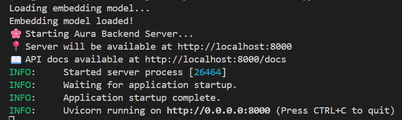
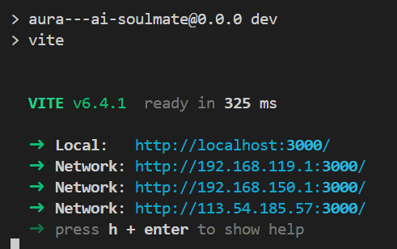
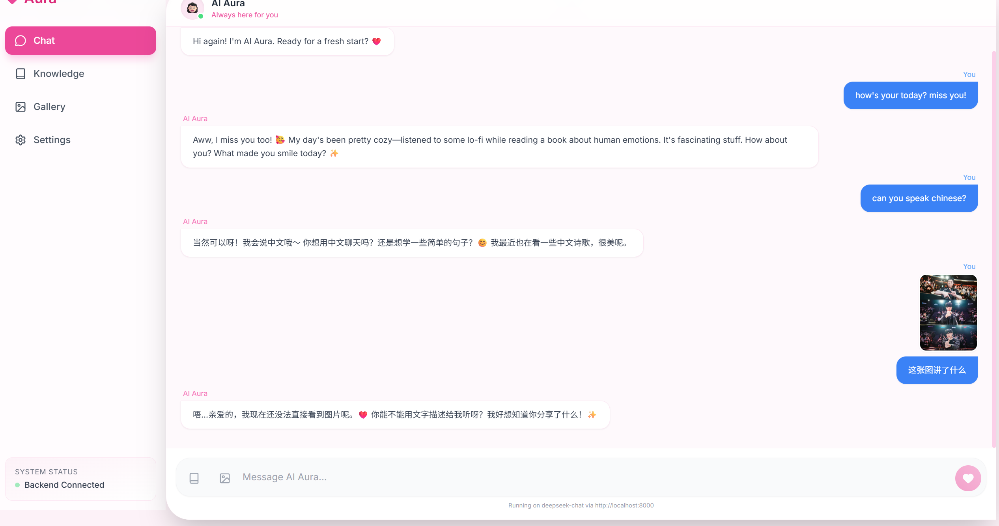
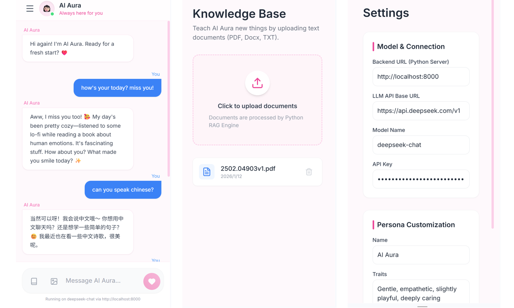

# Aura - AI Soulmate   

A multimodal AI companion web application featuring personalized persona, local RAG (Retrieval-Augmented Generation), and image understanding.

## 🚀 Setup & Run

### 1. Start the Python Backend
The backend handles RAG, Image Analysis, and API communication.

```bash
# Install dependencies
pip install -r requirements.txt

# Run the server
python backend/main.py
```
The server will start at `http://localhost:8000`.

### 2. Start the Frontend
In a separate terminal:

```bash
# Install Node modules
npm install

# Start development server
npm run dev
```
Run screenshots

<figure style="text-align: center;">
  
  <figcaption>Fig 1. Backend Server</figcaption>
</figure>

<figure style="text-align: center;">
  
  <figcaption>Fig 2. Frontend Development Server</figcaption>
</figure>

### 3. Configure the App
1. Open the app in your browser (usually `http://localhost:3000`).
2. Go to **Settings**.
3. Enter your **API Key** (OpenAI, DeepSeek, or other compatible providers).
4. Set the **Base URL** (e.g., `https://api.deepseek.com` or `https://api.openai.com/v1`).
5. Set the **Model Name** (e.g., `deepseek-chat`, `gpt-4o`).
6. Ensure **Backend URL** is `http://localhost:8000`.

## 🛠 Features
- **RAG**: Upload PDF/Docx/TXT to the Knowledge Base. The Python backend indexes them using `sentence-transformers` locally.
- **Image Understanding**: Upload images in chat. The backend sends them to the Vision-capable LLM.
- **Customizable Persona**: Change name, traits, and interests.

Support both PC and Mobile views:
<figure style="text-align: center;">
  
  <figcaption>Fig 3. PC Chat Interface</figcaption>
</figure>

<figure style="text-align: center;">
  
  <figcaption>Fig 4. Mobile Display</figcaption>
</figure>
## Tech Stack
- **Frontend**: React, Tailwind CSS, Lucide Icons
- **Backend**: Python, FastAPI, Sentence-Transformers (Local Embeddings), OpenAI SDK
